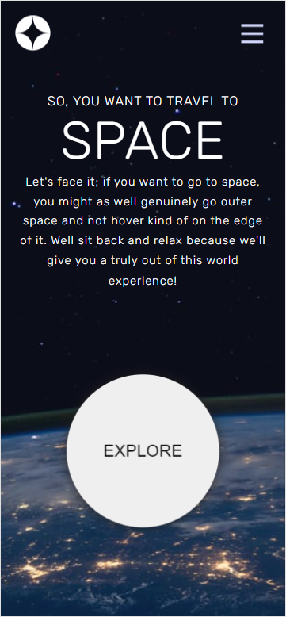

# Space-tourism-website

## Demo avilable on website

https://ungrez.github.io/space-tourism-website/

## Table of contents

- [General info](#general-info)
- [Technologies](#technologies)
- [Screenshots](#screenshots)

## General info

The website is based on the design from frontend mentor. Simple website layout.

## Technologies

- HTML5
- SCSS
- TypeScript
- React.js
- Swiper
- React Router

## Screenshots

